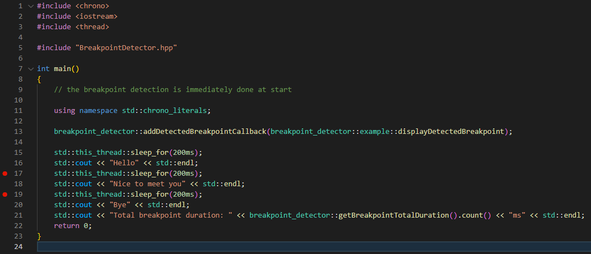

# Breakpoint Detector

# Description

Breakpoint Detector is a **single header c++ library** that allows you to **detect when the execution has been paused by a breakpoint** with the ability to **retrieve the elapsed time while the execution was paused**.

# Installation

Include the file [`BreakpointDetector.hpp`](BreakpointDetector.hpp) in your project.

c++11 or later compilation required.  
No external dependencies.

# Example

*Screenshot of [example.cpp](example.cpp).*



Possible output:
```
Hello
Breakpoint detected: 3001ms
Nice to meet you
Breakpoint detected: 1695ms
Bye
Total breakpoint duration : 4696ms
```

# Usage

```cpp
namespace breakpoint_detector_example
{
	// example of detected breakpoint callback that displays the duration of the detected breakpoint
	static void displayDetectedBreakpoint(const std::chrono::milliseconds& breakpointDuration);
} // namespace breakpoint_detector_example

class BreakpointDetector
{
public:
	// true for bRun in order to start the breakpoint detection at construction
	BreakpointDetector(bool bRun);

	// can be called at any time, ideally in the main function
	void addDetectedBreakpointCallback(DetectedBreakpointCallback detectedBreakpointCallback);
	
	template <class _Rep, class _Period> void run(const std::chrono::duration<_Rep, _Period>& breakpointDetectionDuration);

	/**
	 * @brief start to check if a breakpoint has been detected
	 * should be called once, ideally in the main function
	 * 
	 * @param breakpointDetectionDuration minimum duration from which a breakpoint is detected
	 * @param checkDuration duration used for periodic check of a breakpoint
	 */
	template <class _Rep1, class _Period1, class _Rep2, class _Period2>
	void run(const std::chrono::duration<_Rep1, _Period1>& breakpointDetectionDuration,
		const std::chrono::duration<_Rep2, _Period2>& checkDuration);

	void run(const std::chrono::nanoseconds& breakpointDetectionDuration = std::chrono::nanoseconds(100'000'000), // 100ms
		const std::chrono::nanoseconds& checkDuration = std::chrono::nanoseconds(16'000'000));					  // 16ms

	// sum of all breakpoint detected
	std::chrono::milliseconds getBreakpointTotalDuration() const;

private:
	std::vector<DetectedBreakpointCallback> detectedBreakpointCallbackList;
	std::chrono::milliseconds breakpointTotalDurationMs;
};
```

**Warning: the breakpoint will not be immediately detected.**

# Licence

MIT Licence. See [LICENSE file](LICENSE).
Please refer me with:

	Copyright (c) Nicolas VENTER All rights reserved.
